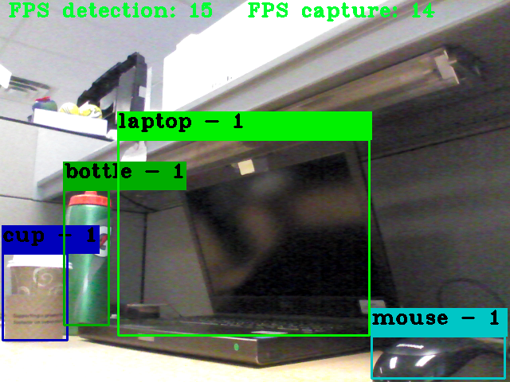
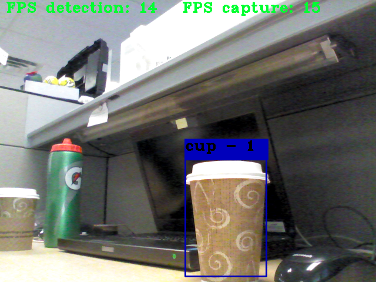
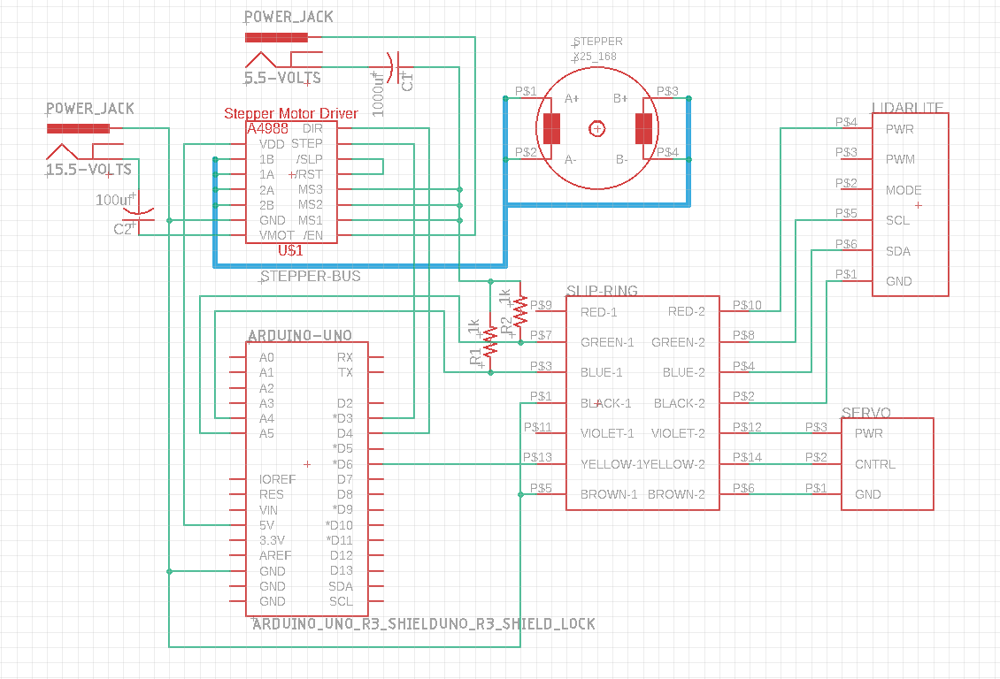
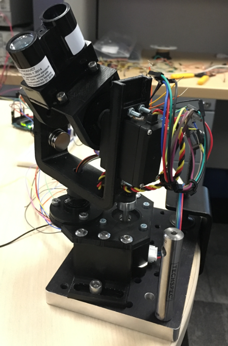
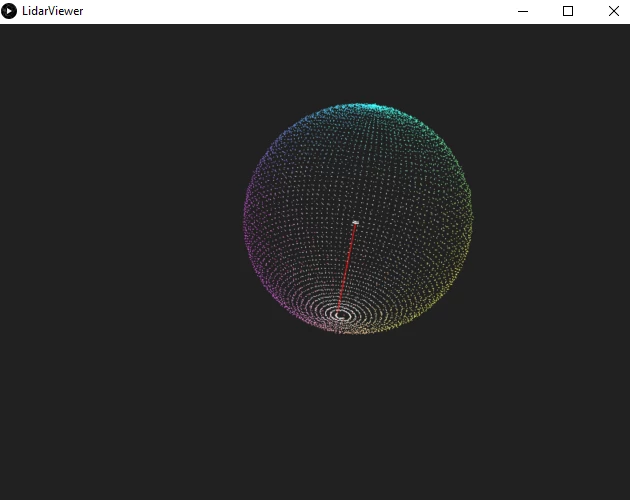

# HODAR

This project aims to do 3D volumetric bounding using a 1D LIDAR and a camera. HODAR can be broken down in four components: fast object detection module, Arduino schematic, Point Cloud viewer, and the Lidar turret. This file goal is to give an overview of each component and how they come together to form HODAR. For more information about each module, please refer to the readme files under their corresponding folders (for object detection you have one under [src](src/README.md) and another one under [darknet](darknet/README.md).

- [Overview](#overview)
- [Fast Object Detection](#fast-object-detection)
- [Arduino - Schematic](#arduino---schematic)
- [LIDAR Turret](#lidar-turret)
    + [Components](#components)
  * [CAD design](#cad-design)
    + [Final Design](#final-design)
    + [Lidar Turret](#lidar-turret)
- [LIDAR Viewer](#lidar-viewer)

## Overview

HODAR uses three different applications to achieve its goal. The first one is the arduino code used to control the motors and to communicate with the Lidar. The second one is the object detection module that analyzes the scene and finds any new object that enters it. The last one is the viewer tool that plots the results. 

As of right now, the Arduino code and the Viewer can be executed together to carry out full 3D scans out of any indoor room. The object detection module is able to find any new objects and bound. However, further development is needed to create a function in the object detection module to send the results to the arduino. This can be achieved easily using the serial port, but I would recommend looking for alternatives so the serial port can be used to send the points for the Point CLoud viewer.

## Fast Object Detection

Deep learning has been proved to be a very fast and reliable manner to carry out object detection. There are different neural networks dedicated to this task such as: CNN, R-CNN, YOLO... For this project I decided to choose You Only Look Once (**YOLO**) since it was proven to be the fast one and accuracy was not as important as speed. HODAR purpose is to detect and bound any new object that enters the scene, clasifying it is out of the scope for now. For this reason, YOLO was the best choice. The neural network is ran in the GPU using CUDA, and it is connected to a Wbecam using OPENCV. Consequently, the live feed of the camera is analyzed in real time, and any new object that enters the scene is identified. Next, the coordinates of its centroid and the size of the bounding box is sent to the Arduino to start the 3D volumetric bounding using the Lidar and motors. Below there is a quick preview of how the object detection process works:

Scene | New Object Detected
:------------------: | :------------------------------:
 | 

More information about this module can be found under its own [Readme file](src/README.md). Additionally, you can find more information about the math behind the neural network in its [academic paper](https://pjreddie.com/media/files/papers/YOLOv3.pdf) and in the [darknet framework readme](darknet/README.md).

## Arduino - Schematic

In this project we use the Arduino UNO to control the turret motors and to communicate to the LIDAR. Below there is a schematic of the circuit sketched using Eagle CAD.

There are two different ways to communicate with the LidarLite: using power modulation or I2C protocol. In this case, I chose to use the I2C for simplicity and reliability. Consequently, the SCL and SDA lines require pull up resistors. On the other hand, the servo can be controlled directly using one of the Arduino Libraries, but for the stepper motor we had to use an A4988 controller. Using the controller you can select the step resolution of the motor. For us, we want the smallest step possible to acquire as many points as needed. Consequently, the MS1, MS2, MS3 pins need to be pulled HIGH. Also, we need two different power sources: one for the stepper (around 15 Volts), and another one for remaining components (5.5 Volts). 

Finally, a Slip Ring is used to enable the continuous 360 rotation, and two capacitors are used to protect the Lidar and the A4988 chip from power spikes.

## LIDAR Turret

All the components of the Lidar turret were designed using SolidWorks and then 3D printed. For the assembly process, a few parts needed to be modified in the machine shop. These modifications were very straight forward and mostly involved introducing threaded inserts. 

#### Components

- LIDAR
- Stepper Motor
- Servo Motor
- 12 Wire Slip Ring
- A4988 controller

### CAD design

Below you can find a comparison of the final CAD design and the 3D printed assembled result. The Solidworks parts can be found in my share drive:

`N:\ENGINEERING\dramonprados\HODAR Turret_SolidWorks`

#### Final Design

#### Lidar Turret

## LIDAR Viewer

A simple tool visualization tool is included in the project. The viewer uses JAVA and the sketching software tool Processing to display the points in 3D. It also allows to save and or load points from xyz file. 

For real time output, it uses serial communication to read the data from the arduino. However, the object detection algorithm also uses serial data to send the location of the new object to the arduinon. Consequently, both of them are not compatible at the moment. 

